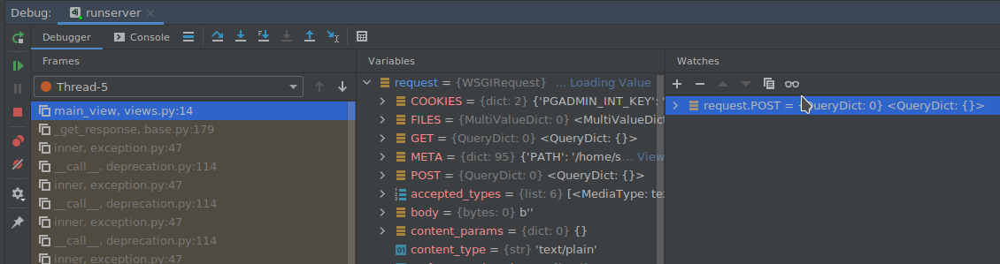

# УРОК №1
Команды работы с виртуальным окружением (venv)
```
deactivate 
# Linux / Mac
source venv/bin/activate
# Windows
venv/Scripts/activate.bat
```

Документация  
https://www.djangoproject.com/  

https://djbook.ru/rel3.0/#

Основные команды Django
```
# Установка 
pip install Django
# Создание нового проекта
django-admin startproject todo
# Создание нового app (эпликейшн)
python manage.py startapp main
```


ДЗ
```
1. Создать еще один app "todo_item"
   python manage.py startapp todo_item
2. Закомитить и запушить изменения в GIT
3. Прислать ссылку с pull request
вида https://github.com/sergkot2020/todo/pull/1
4. Установить Postgresql 
```

# УРОК №2
## План занятия:
### Донастройка окружения  
- обзор пред. урока  
- структура django-app (связка model -> view -> url)
- настройка run\debug и первый запуск django сервера
- DBeaver создание БД для проекта
    https://dbeaver.io/download/  
- Подключение Postgres  
- Создание супер-пользователя  
- Миграции 
- Служебные таблицы django
### Обновляем requirements.txt
- pip freeze > requirements. txt   
### HTTP, клиент-сервер
- HTTP (основные типы запросов\ответов)
- Пользовательские сесии
- Куки

### Шаблоны
- синтаксис шаблонов (if\for)
- templatetags

------------------------------------------------------------

### структура django-app (связка model -> view -> url)
- migrations - Папка в которой хрнятся все изменения в Базе Данных
- admin.py - Файл для работы с админкой
- apps.py - служебный файл с именем app
- models.py - файл с моделями/таблицами баз данных 
- test.py - файл с тестами приложения
- views.py - файл с вьюхами (фунцкии обработки запросов от пользователя)

### настройка run\debug и первый запуск django сервера  

- Включение django-support в проекте  

  

- Настройка run/debug  

  

### DBeaver создание БД для проекта  

- создание подключения к БД

  

- создание новой базы **todo**

## Подключение Postgres  

- Какие БД поддерживает джанга
- Почему PostgresSQL?  
https://postgrespro.ru/education/courses
- Установка драйверов
```
pip install psycopg2-binary
pip install psycop2
```  

- Прописать базу в settings.py
```python
DATABASES = {
    'default': {
        "ENGINE": "django.db.backends.postgresql",
        "HOST": "127.0.0.1",
        "NAME": "todo",
        "USER": "postgres",
        "PASSWORD": "pasword",
        "PORT": 5432
    }
}
```
- Миграции  
https://docs.djangoproject.com/en/3.0/topics/migrations/
```yaml
python manage.py migrate
python manage.py makemigrations
python manage.py showmigrations
```
- Создание суперпользователя
```yaml
python manage.py createsuperuser
```

## Templates
- подключение шаблона main
- синтаксис шаблонов
```python
# Переменные
{{ variable }}

# Использование функций
{{ name|lower }}
{{ name|length }}

# Работа с объектами/словарями
class Man:
    def __init__(self, age, weight)
        self.age = age
        self.weight = weight

man_obj = Man(15, 100)
man_dict = {'age': 45, 'weight': 100}

# в шаблоне 
{{ man_obj.age }} -> 15 
{{ man_dict.age }} -> 15 

# оператор if 

    Number of athletes: {{ athlete_list|length }}

    Athletes should be out of the locker room soon!

    No athletes.


# цикл for
<ul>

    <li>Возраст: {{ age }} Вес: {{ weight }}</li>

</ul>

# Использование своих тегов
{{ get_count }}
# передача аргументов в тег, можно так же в выржание if или for
arg = 'some argument'


```
- функция **render**
```python
data = {
    'lists': [
        {'name': 'Работа', 'is_done': True, 'date': '01.12.2019'},
        {'name': 'Дом', 'is_done': False},
        {'name': 'Учеба', 'is_done': True}
    ],
    'user_name': 'Admin',
}


def main_view(request):
    context = data
    return render(request, 'index.html', context)
```  

https://docs.djangoproject.com/en/3.0/ref/templates/  

## Д\З
- Повторить проделанные нами операции по подключению БД
- Создать новое приложение(app) **django-admin startapp list_item**
- Написать к нему вьюху
- Сделать шаблон(template) по аналогии с main и заполнить данными из словаря

- Добавить стиль CSS "id_done" в верстку
- *Создать свой **templatetag**, и с помощью него реализовать следующую задачу 
(на главной странице).  
У нас на странице создается столько строк, сколько мы передаем строк данных,
но выглядит не очень красиво если строк мало. 
Нужно (только средствами языка шаблонов) сделать так, чтобы
если нам передается строк меньше чем **6шт**, добить пустыми div блоками 
страницу, чтобы в сумме было 6шт блоков.  
-> Например 3 заполненных, 3 пустых.  
-> Если передаем 5 строк с данными то соответсвенно 5 заполненных 1 пустой.  
-> Если передаем 8 строк с данными - 8 заполненных блоков.  

Пример:  


Ссылка на документацию:  
https://docs.djangoproject.com/en/3.0/howto/custom-template-tags/  
 
Не забываем также создать папку **templatetags**, в которой нужно разместить модуль с функцией тега:  
  


Также нужно дополнительно зарегистрировать нашу библиотеку тегов в 
**settings.py**  
```python
INSTALLED_APPS = [
    'django.contrib.admin',
    'django.contrib.auth',
    'django.contrib.contenttypes',
    'django.contrib.sessions',
    'django.contrib.messages',
    'django.contrib.staticfiles',
    'main',
    'main.templatetags'
]
```
И подгрузить библиотеку тегов на страницу шаблона:  


# УРОК №3
## План урока
- Разбор ДЗ
    - про имена переменных\функций
    - константы
    - докстринги
    - перенос длинных строк
    - глубина вложенности условий (менье 4)
```python
@register.simple_tag()
def printitems():
    if len(data['lists']) > 6:
        for i in range(len(data['lists'])):
            return items(data['lists'][i])
    else:
        for i in range(len(data['lists'])):
            return items(data['lists'][i])

def items(dictt):
    if dictt['is_done']:
        return mark_safe(TABLE_HEADER + '''<a href="#"><li class="is_done_text">''' + dictt['name'] + '''</li></a></div>''' + TABLE_TAIL)
    else:
        return mark_safe(TABLE_HEADER + '''<a href="#"><li>''' + dictt['name'] + '''</li></a></div>''' + TABLE_TAIL)
```
- пакетные зависимости  
    pip freeze > requirements. txt 
- служебный таблицы Django (пользователь \ хранение паролей)
- Пользовательские сессии
- Куки

- Наследование шаблонов
- Оптимизация роутинга URL-адресов
- DEBUG Pycharm
    - Навигация 
    - Debug циклов
    - Watches
------------------------------------------------------------------------------
## Наследование шаблонов
- теги block, extend
```



    <title>Главная</title>



    <div class="table-data_table-header-item-1">TO DO List</div>

```
## Оптимизация роутинга URL
- функций include, и app_name = 'main'
```python


# \todo\todo\urls.py
urlpatterns = [
    path('admin/', admin.site.urls),
    path('', include('main.urls')),
    path('list/', include('list.urls')),
]

# \todo\main\urls.py
app_name = 'main'

urlpatterns = [
    path('', main_view, name='main'),
    path('create/', create_new_list, name='create')
]
```
- Обрашение в темплейте по app_name
```python
 <a href=''>
```

## DEBUG
### Запуск дебаггера

### Установка break-point

### Панель управления

-------------------------------------------------------------------------
## ДЗ
- Найти причину ошибки
    - Указать номер элемента на котором ломается алгоритм
    - Указать сам этот элемент
- Исправить алгоритм (чтобы функция отработала до конца и
распечатала результат)  

```python
# Данные data.pkl

# Алгоритм debug.py
import datetime
import pickle


def get_array():
    with open('data.pkl', 'rb') as file:
        return pickle.load(file)


def merge(left_arr, right_arr):
    i = 0
    j = 0
    len_left = len(left_arr)
    len_right = len(right_arr)
    result = []
    while i < len_left and j < len_right:
        left = left_arr[i]
        right = right_arr[j]
        if left_arr[i] < right:
            result.append(left)
            i += 1
        else:
            result.append(right)
            j += 1
    result.extend(left_arr[i:])
    result.extend(right_arr[j:])
    return result


def merge_sort(array):
    e = len(array)
    s = 0
    if (e - s) > 1:
        medium = int((s + e) / 2)
        left_arr = merge_sort(array[s:medium])
        right_arr = merge_sort(array[medium:e])
        return merge(left_arr, right_arr)
    return array


def run(func, array):
    start = datetime.datetime.now()
    print('=' * 20, f' START {func} ', '=' * 20)
    print('START: ', start)
    print('first 50 sorted words:', func(array[:])[:50])
    finish = datetime.datetime.now()
    print('FINISH: ', finish)
    print('RESULT: ', finish - start)


if __name__ == '__main__':
    arr = get_array()
    run(merge_sort, arr)

```

